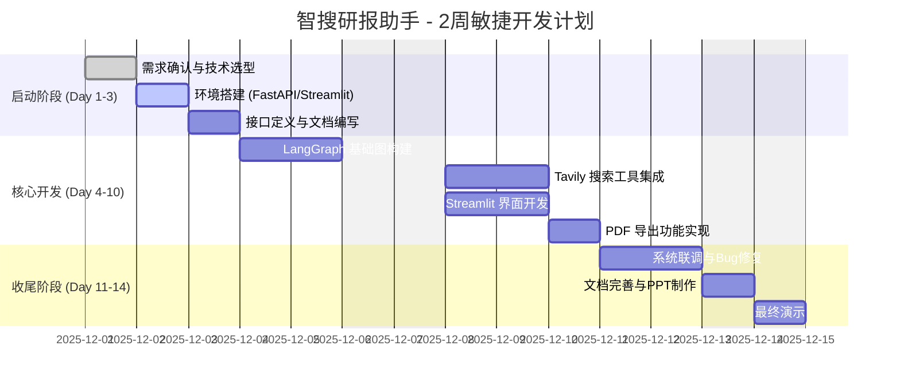

# 3. 项目管理计划 (2周冲刺版)

## 1. 项目概况
本项目为期 **2周 (14天)**，目标是快速开发一个可演示的“智搜研报助手”MVP。

## 2. 进度计划 (Gantt图)

## 3. 每日任务清单

### Week 1: 核心逻辑攻关
*   **Mon**: 搭建 Git 仓库，初始化 Python 虚拟环境，跑通 Hello World。
*   **Tue**: 编写 LangGraph 代码，实现 `Router -> Chat` 简单流程。
*   **Wed**: 申请 Tavily API Key，集成 `Search Tool`，实现联网问答。
*   **Thu**: 引入 `SqliteSaver`，实现多轮对话记忆。
*   **Fri**: 搭建 Streamlit 基础界面，打通与后端的 API 调用。

### Week 2: 功能完善与交付
*   **Mon**: 开发 PDF 生成模块，解决中文字体乱码问题。
*   **Tue**: 将 PDF 导出按钮集成到 Streamlit 界面。
*   **Wed**: 全面测试（长文本、异常网络、无效Key），修复 Bug。
*   **Thu**: 编写《用户手册》和《测试报告》，制作演示 PPT。
*   **Fri**: 最终代码 Review，打包提交。

## 4. 风险管理
*   **API 额度耗尽**：预备多个免费 Key，或在开发阶段使用 Mock 数据。
*   **PDF 排版困难**：若 ReportLab 过于复杂，备选方案为直接导出 Markdown 或 HTML。
