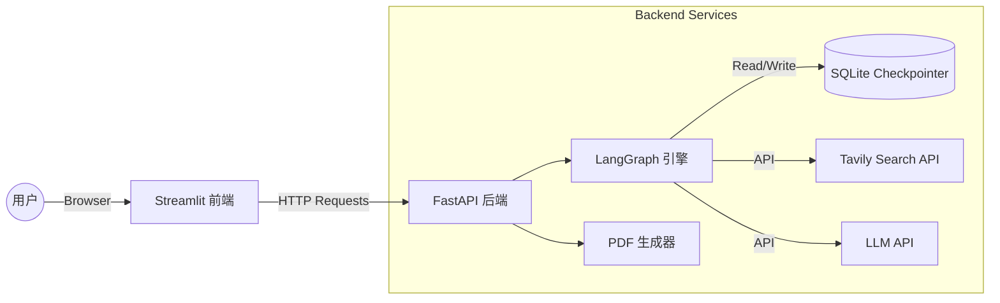

# 4. 系统设计文档 (精简版)

## 1. 系统架构设计

### 1.1 总体架构
为适应“2周学生开发项目”的特点，本系统采用 **轻量级 B/S 架构**。前端使用 Streamlit 直接渲染 UI，后端使用 FastAPI 暴露核心逻辑，数据存储采用 SQLite。

### 1.2 模块划分
1.  **Frontend (Streamlit)**:
    *   `app.py`: 主入口，渲染聊天界面和侧边栏配置。
    *   `api_client.py`: 封装对后端的 HTTP 请求。
2.  **Backend (FastAPI)**:
    *   `main.py`: 定义 `/chat`, `/pdf` 等路由。
    *   `graph.py`: 定义 LangGraph 的 Node 和 Edge。
    *   `pdf_gen.py`: 封装 ReportLab 逻辑。

## 2. 核心流程设计

### 2.1 智能搜索流程
这是系统的核心，利用 LangGraph 实现。

1.  **Start** -> **Orchestrator Node (Router)**
    *   输入：用户最新的问题。
    *   动作：LLM 分析意图。
    *   输出：`search` 或 `chat`。
2.  **Branch 1: Search Node**
    *   动作：调用 Tavily API。
    *   输出：更新 State 中的 `search_results`。
    *   流向：-> **Chat Node**
3.  **Branch 2: Chat Node**
    *   动作：LLM 结合 `search_results` (若有) 生成回答。
    *   流向：-> **End**

### 2.2 PDF 生成流程
1.  用户点击“导出 PDF”。
2.  前端发送当前 Session ID 给后端。
3.  后端从 SQLite 中读取该 Session 的所有 `AIMessage` 和 `HumanMessage`。
4.  后端调用 `ReportLab`，按顺序绘制：
    *   封面（标题 + 时间）
    *   对话内容（Q: Bold, A: Normal）
    *   参考链接（从 `search_results` 中提取）
5.  返回 PDF 二进制流，浏览器触发下载。

## 3. 关键技术点设计

### 3.1 状态持久化
使用 `langgraph.checkpoint.sqlite.SqliteSaver`。
*   优点：零配置，无需安装 MySQL/Redis，数据文件随项目移动，非常适合课程设计演示。

### 3.2 流式传输 (Streaming)
为避免长文本生成时的等待焦虑，后端 `/chat` 接口使用 SSE (Server-Sent Events) 协议。
前端使用 `requests.post(..., stream=True)` 并在循环中逐块读取数据，实时更新 Streamlit 的 `st.write_stream` 或 `st.markdown`。

### 3.3 中文 PDF 支持
ReportLab 默认不支持中文。设计方案：
*   在项目 `assets/` 目录下放置 `SimSun.ttf` (宋体) 或开源字体。
*   系统启动时调用 `pdfmetrics.registerFont()` 注册字体。
*   在生成 PDF 时指定 `fontName='SimSun'`。

## 4. 部署方案
*   **本地运行**：
    1.  启动后端：`uvicorn backend.app.main:app --reload`
    2.  启动前端：`streamlit run frontend/app.py`
*   **配置**：所有 API Key 通过 `.env` 文件加载，不硬编码在代码中。
